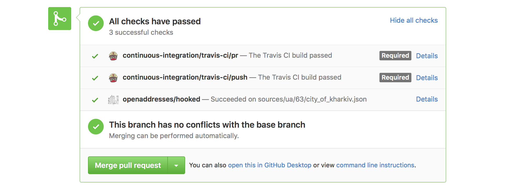

<h1 align="center">OA Machine</h1>

Scripts for running OpenAddresses on a complete data set and publishing
the results. Uses [OpenAddresses](https://github.com/openaddresses/openaddresses)
data sources to work.

Status
------

This code is being used to process the complete OA dataset on a weekly and on-demand
basis, with output visible at [results.openaddresses.io](https://results.openaddresses.io).

Usage
-----

Machine is an integral of the OpenAddresses project. When new sources
[are added in Github](https://github.com/openaddresses/openaddresses#contributing-addresses),
they are automatically processed and status output is displayed in Github’s
pull request UI. A successful set of checks looks like this:

More information about Machine’s output can be seen by following the Details link
[to a job page like this](http://results.openaddresses.io/jobs/b044ce9c-caa0-46fb-a7e4-842beeae3f52).

Machine also runs its own weekly batch process to generate the downloadable
files, maps, and other resources available via [results.openaddresses.io](https://results.openaddresses.io).

Development
-----------

[Documentation for Machine internals](docs/README.md) can help point you in the
right direction for development. Follow the [installation instructions](docs/install.md)
to use and modify Machine code locally.
